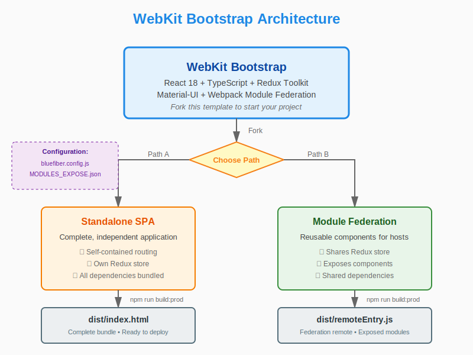
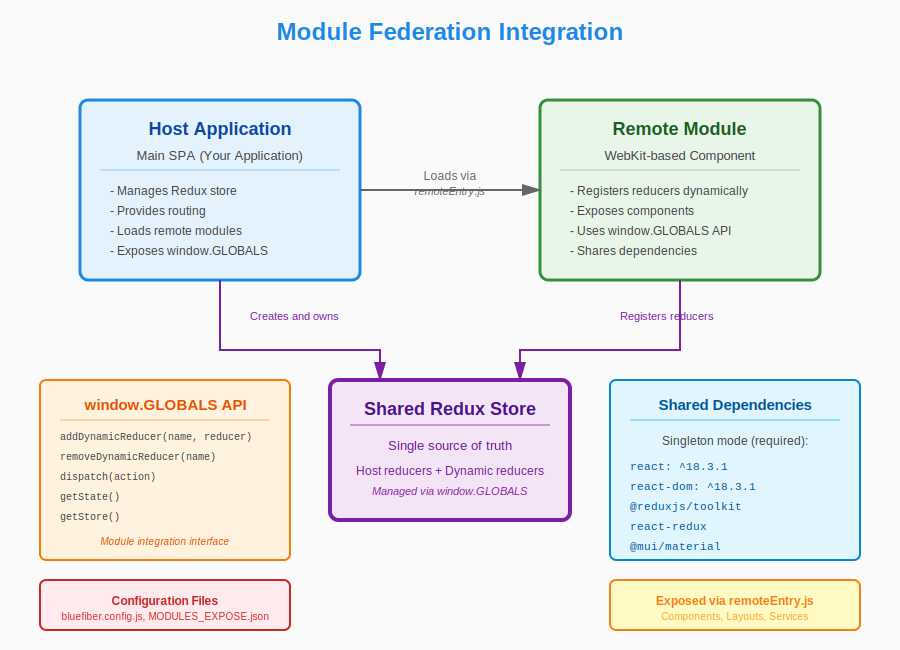

# WebKit — React + TypeScript Bootstrap

[](https://www.typescriptlang.org/)
[](https://reactjs.org/)
[](https://redux-toolkit.js.org/)
[](https://mui.com/)
[](https://webpack.js.org/)

**A production-ready React + TypeScript bootstrap for building frontend applications and Module Federation components.**

WebKit provides a complete, modern frontend development environment with React 18, TypeScript, Redux Toolkit, Material-UI, and Webpack Module Federation. Use it to build standalone SPAs or reusable components that integrate with other applications.

---

## 🎯 Using WebKit

**WebKit is a bootstrap template** - fork it to start your project in one of two ways:



### Path A: Standalone SPA
Fork WebKit to build a complete, independent single-page application with all features included.

### Path B: Module Federation Component
Fork WebKit to build reusable components that integrate into other applications, sharing Redux store and design system.

**👉 [Read the Complete Getting Started Guide](./GETTING-STARTED.md)**

The getting started guide provides:
- Detailed instructions for both SPA and Module Federation paths
- Step-by-step forking and setup procedures
- Build process explanation and configuration
- Integration patterns and best practices
- Optimized for both human and AI-assisted development

---

## 🚀 Quick Start

### Prerequisites
- **Node.js** 18.x or higher (recommended)
- **npm** (or pnpm/yarn)

### Installation

```bash
# Clone the repository
git clone <repository-url>
cd WebKit

# Install dependencies
npm ci
```

### Development

```bash
# Start development server with hot reload
npm run dev
```

The dev server will start using the BlueFiber webpack configuration. Access the application at the configured port.

### Building

```bash
# Production build (optimized)
npm run build:prod

# Debug-friendly build (unminified)
npm run build:debug

# E2E test build
npm run build:e2e
```

### Testing

```bash
# Run Jest tests
npm run test:jest

# View component library in Storybook
npm run storybook

# Serve production build locally
npm run serve
```

---

## 📦 What's Inside

### Technology Stack

| Category | Technology | Version | Purpose |
|----------|-----------|---------|---------|
| **Core** | | |
| Language | TypeScript | 5.7.2 | Type-safe JavaScript development |
| Framework | React | 18.3.1 | UI component library |
| State Management | Redux Toolkit | 2.4.0 | Predictable state container |
| **UI/Styling** | | |
| Component Library | Material-UI | 6.1.10 | Pre-built React components |
| Icons | MUI Icons | 6.1.10 | Material Design icons |
| Styling Engine | Emotion | 11.14.0 | CSS-in-JS solution |
| Notifications | react-toastify | 11.0.5 | Toast notifications |
| **Build & Dev Tools** | | |
| Bundler | Webpack | 5.97.1 | Module bundler with federation |
| Transpiler | Babel | 7.26.0 | JavaScript compiler |
| Test Runner | Jest | 29.7.0 | Testing framework |
| Component Docs | Storybook | 8.4.6 | Component development environment |
| Linter | ESLint | 9.16.0 | Code quality analysis |
| Formatter | Prettier | 3.4.2 | Code formatting |
| **Testing** | | |
| Testing Library | React Testing Library | 15.0.7 | Component testing utilities |
| DOM Testing | @testing-library/jest-dom | 6.4.5 | Custom Jest matchers |
| User Events | @testing-library/user-event | 14.5.2 | User interaction simulation |

### Project Structure

```
WebKit/
├── src/                    # Application source code
│   ├── assets/            # Static assets
│   ├── entries/           # Module entry points
│   ├── external/          # External integrations
│   ├── store/             # Redux store configuration
│   ├── styles/            # Global styles and themes
│   └── utils/             # Utility functions
├── blueFiberSrc/          # Custom webpack configuration
├── public/                # Static public assets
├── docs/                  # Generated documentation
├── _bmad/                 # BMAD workflows and agents
├── .storybook/            # Storybook configuration
├── .github/workflows/     # CI/CD pipelines
└── [config files]         # Various configuration files
```

**Key Entry Points:**
- `src/App.jsx` - Main application component
- `src/InitComp.tsx` - Initialization component
- `blueFiberSrc/_webpack.bf.*.js` - Custom webpack configurations

---

## 🏗️ Architecture

### Design Pattern
Component-based frontend architecture with centralized state management using Redux Toolkit.

### Key Characteristics
- **Single-Page Application (SPA)** structure
- **Redux Toolkit** for predictable, scalable state management
- **Material-UI** component library for consistent, accessible UI
- **Webpack Module Federation** ready for micro-frontend architecture
- **Storybook** for isolated component development
- **TypeScript** for type safety and better developer experience

### Module Federation
This project is configured for **Webpack Module Federation**, allowing it to expose or consume remote modules for micro-frontend architecture. Components can be shared across multiple applications while maintaining a unified Redux store.



See `MODULES_EXPOSE.json` for exposed modules configuration and [GETTING-STARTED.md](./GETTING-STARTED.md#path-b-building-a-module-federation-component) for complete integration instructions.

---

## 🧪 Testing Strategy

### Test Framework
**Jest** with **React Testing Library** for comprehensive component testing.

### Test Configuration
- **Config:** `jest.config.js`
- **Setup:** `jest.setup.js`
- **Polyfills:** `jest.polyfills.js`
- **Environment:** jsdom (browser simulation)

### Test Types
- **Unit tests** - Component-level testing
- **Integration tests** - Multi-component interaction testing
- **Snapshot tests** - Visual regression testing via Storybook

### Coverage Reporting
- HTML reports via `jest-html-reporters`
- JUnit XML via `jest-junit`

---

## 🛠️ Build System

### Webpack Configuration
Custom **BlueFiber** webpack configuration with multiple build modes:

- **`dev`** - Development server with hot module replacement
- **`build:prod`** - Production build with optimization
- **`build:debug`** - Debug-friendly build without minification
- **`build:e2e`** - E2E testing build

### Features
- **Module Federation** support via `external-remotes-plugin`
- **Conditional Compilation** via ifdef-loader
- **Feature Flags** via `features-flags-dev.json` and `features-flags-prod.json`
- **Custom Environment Configuration** via `env.config.json`

---

## 📚 Documentation

### Comprehensive Documentation Available

**Start here:** [Documentation Index](./docs/index.md) - Your primary entry point for all documentation.

The project includes comprehensive, AI-optimized documentation generated through an exhaustive scan:

#### Project Structure & Architecture
- **[Project Structure](./docs/project-structure.md)** - High-level organization and folder hierarchy
- **[Source Tree Analysis](./docs/source-tree-analysis.md)** - Annotated directory tree with detailed explanations
- **[Technology Stack](./docs/technology_stack.md)** - Analysis of 100+ technologies used
- **[Project Parts Metadata](./docs/project-parts-metadata.md)** - Project metadata and detection evidence

#### Development & Deployment
- **[Development Guide](./docs/development-guide.md)** - Complete setup, workflow, and best practices
  - Environment setup and prerequisites
  - Development commands and workflows
  - Testing strategy (Jest + Storybook)
  - Code quality standards (ESLint, Prettier, TypeScript)
  - Adding new features and components
  - Redux state management patterns

- **[Deployment Guide](./docs/deployment-guide.md)** - Production deployment procedures
  - Docker deployment (multi-stage builds)
  - Kubernetes configuration and manifests
  - CI/CD pipeline setup
  - Monitoring, scaling, and rollback procedures

#### Technical Documentation
- **[Data Models](./docs/data-models-1.md)** - Redux store structure and state management
  - Track Slice (location tracking)
  - Todos Slice (todo management)
  - Module federation integration
  - Normalized state patterns

- **[UI Component Inventory](./docs/ui_component_inventory_1.md)** - Complete component catalog
- **[Component Usage Map](./docs/component-usage-map-1.md)** - Component dependencies
- **[API Contracts](./docs/api-contracts-1.md)** - API integration patterns
- **[CI/CD Detection](./docs/ci_cd_detection.md)** - Continuous integration setup

### Documentation Features

✨ **Navigation by Role:**
- Frontend Developer: Development guide → Source tree → Data models
- DevOps Engineer: Deployment guide → CI/CD → Technology stack
- Architect/Tech Lead: Project structure → Source tree → Data models
- Product Manager: Project structure → Component inventory

✨ **Navigation by Task:**
- Adding a new feature
- Debugging production issues
- Onboarding new team members
- Planning architecture changes

### For Brownfield PRD Creation

When planning new features for this existing project, use [docs/index.md](./docs/index.md) as input to PRD workflows. It provides:
- Current architecture and patterns
- Technology stack and constraints
- Component inventory and reusability
- State management approach
- Development and deployment procedures

### BMAD Workflows

This project includes embedded **BMAD** (Build, Measure, Analyze, Document) workflows for automated documentation generation:

- **Framework Location:** `_bmad/bmm/` and `_bmad/core/`
- **Workflow Output:** `_bmad-output/project-scan-report.json`
- **Documentation Location:** `docs/` (16 comprehensive documents)

#### Last Documentation Update
- **Date:** 2026-01-10
- **Workflow:** document-project v1.2.0
- **Scan Level:** Exhaustive (complete project scan)
- **Files Generated:** 16 documents (~5,100 lines of documentation)

#### Re-generating Documentation
To update documentation after major changes:
1. Run the BMAD analyst agent
2. Select **Document Project** workflow
3. Choose **Re-scan entire project**
4. Select scan depth (Quick/Deep/Exhaustive)
5. Review and commit updated documentation

#### Available BMAD Workflows
Beyond documentation, BMAD provides workflows for:
- Creating PRDs and architecture documents
- Sprint planning and story creation
- Code review and implementation readiness checks
- Test architecture and quality validation
- UX design and technical specifications

---

## 🔧 Development Guidelines

**For complete development guidelines, see [Development Guide](./docs/development-guide.md)**

### Quick Reference

#### Code Quality
- **ESLint** configuration in `eslint.config.mjs`
- **Prettier** for consistent formatting (`.prettierrc.json`)
- **TypeScript** strict mode enabled
- Type checking: `npx tsc --noEmit`

#### Testing Requirements
- Add unit tests for new components in `__tests__/` directories
- Maintain test coverage for critical paths
- Use React Testing Library best practices
- Run tests: `npm run test:jest`

#### Component Development
- Follow the **Entry Pattern** (see [Source Tree Analysis](./docs/source-tree-analysis.md))
- Keep Storybook stories updated under `__stories__/` directories
- Document complex components with inline JSDoc comments
- Follow Material-UI theming conventions (`MuiTheme.js`)
- Check [Component Inventory](./docs/ui_component_inventory_1.md) for reusable components

#### Adding a New Feature
1. Create entry folder: `src/entries/{FeatureName}/`
2. Create Redux slice: `store/{feature}.slice.ts`
3. Create selectors: `store/{feature}.selectors.ts`
4. Build components in `components/`
5. Add layouts in `layouts/`
6. Create entry lifecycle: `{feature}.entry.ts`

See detailed instructions in [Development Guide](./docs/development-guide.md#adding-a-new-feature-module)

#### Build Targets
- **Development:** `npm run dev` - Hot reload, fast iteration
- **Debug:** `npm run build:debug` - Source maps for debugging
- **Production:** `npm run build:prod` - Optimized for deployment
- **E2E Testing:** `npm run build:e2e` - Test-specific build

---

## 🚢 CI/CD

**For complete deployment procedures, see [Deployment Guide](./docs/deployment-guide.md)**

### GitHub Actions
A CI/CD pipeline is configured in `.github/workflows/ci.yml`:

- **Triggers:** Push/PR to `main`, `master`, `develop`
- **Steps:** Install → Build → Test
- **Node Version:** 18.x

### Docker Deployment
Multi-stage Docker build configured in `DockerfileFull`:
- **Stage 1:** Build with Node.js 22.12.0
- **Stage 2:** Serve with NGINX 1.27.0-alpine-slim
- **Port:** 8080
- **Deployment:** Docker, Kubernetes, OpenShift ready

### Quick Deploy
```bash
# Build Docker image
docker build -f DockerfileFull -t webkit:latest .

# Run locally
docker run -d -p 8080:8080 webkit:latest

# Deploy to Kubernetes
kubectl apply -f k8s/deployment.yaml
```

See [Deployment Guide](./docs/deployment-guide.md) for:
- Kubernetes manifests and configuration
- Environment variable injection
- Scaling and monitoring
- Rollback procedures
- Security best practices

---

## 🤝 Contributing

We welcome contributions! Here are some guidelines:

1. **Fork the repository** and create a feature branch
2. **Write tests** for new functionality
3. **Follow code style** guidelines (ESLint + Prettier)
4. **Update documentation** for significant changes
5. **Run tests** before submitting (`npm run test:jest`)
6. **Submit a pull request** with a clear description

For detailed contribution guidelines, consider adding a `CONTRIBUTING.md` file.

---

## 📋 Available Scripts

| Command | Description |
|---------|-------------|
| `npm run dev` | Start development server with HMR |
| `npm run build:prod` | Production build (optimized) |
| `npm run build:debug` | Debug build (unminified) |
| `npm run build:e2e` | E2E test build |
| `npm run test:jest` | Run Jest tests |
| `npm run storybook` | Start Storybook on port 6006 |
| `npm run build-storybook` | Build static Storybook |
| `npm run serve` | Serve production build on port 3002 |
| `npm run clean` | Remove dist directory |

---

## 🗺️ Roadmap

### Completed ✅
- React 18 + TypeScript setup
- Redux Toolkit integration
- Material-UI component library
- Webpack Module Federation
- Jest + React Testing Library
- Storybook component documentation
- BMAD documentation workflows

### Planned 🚧
- E2E testing framework (Playwright/Cypress)
- Enhanced CI/CD pipelines
- Component library extraction
- Performance optimization guides
- Accessibility audit and improvements

---

## 📞 Support & Resources

### Getting Help
1. **Documentation:** Start with [docs/index.md](./docs/index.md) - comprehensive navigation
2. **Development Questions:** See [Development Guide](./docs/development-guide.md)
3. **Deployment Issues:** Check [Deployment Guide](./docs/deployment-guide.md)
4. **Architecture Questions:** Review [Source Tree Analysis](./docs/source-tree-analysis.md)

### Project Information
- **Project Owner:** Alon (see `_bmad/bmm/config.yaml`)
- **Issues:** Open an issue in the repository
- **Documentation Last Updated:** 2026-01-10 (exhaustive scan)

---

## 📄 License

Please add a `LICENSE` file to specify the license for this project.

---

## 🙏 Acknowledgments

Built with modern web technologies and optimized for both human developers and AI-assisted development workflows.

**Powered by:**
- React Team for the amazing framework
- Redux team for Redux Toolkit
- Material-UI team for the component library
- The open-source community

---

## 📊 Project Statistics

- **Documentation:** 16 comprehensive documents (~5,100 lines)
- **Technologies:** 100+ documented across 12 categories
- **Redux Slices:** 2 (track, todos)
- **Test Coverage:** Unit tests + Storybook stories
- **Architecture Pattern:** Module Federation with Dynamic Reducers

---

**Documentation last updated:** 2026-01-10
**Documentation workflow:** BMAD `document-project` v1.2.0 (exhaustive scan)
**Primary entry point:** [docs/index.md](./docs/index.md)
